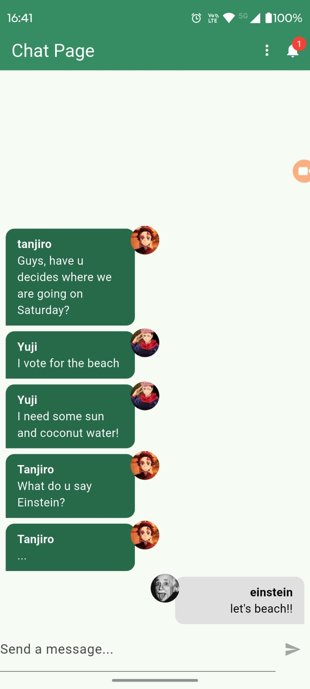

# 💬 Chat App com Flutter + Firebase

Aplicativo de chat em tempo real construído em Flutter, integrado ao ecossistema Firebase para autenticação, armazenamento de mensagens e envio de notificações push.

## 📱 Demonstração

<p align="center">
	
</p>

## ✨ Funcionalidades

- Autenticação por e-mail/senha com upload de avatar opcional
- Chat em tempo real usando Cloud Firestore
- Armazenamento de fotos de perfil no Firebase Storage
- Notificações push (foreground, background e app fechado) via Firebase Cloud Messaging
- Validações de formulário e feedback visual durante operações assíncronas

## 🧠 Conceitos Trabalhados

- Inicialização Firebase (`Firebase.initializeApp`, `FirebaseAppCheck`)
- Gerência de estado simples com Provider (`MultiProvider`, `ChangeNotifier`)
- Streams reativas para sessões (`authStateChanges`) e mensagens (`snapshots`)
- Manipulação de uploads de arquivo e URLs públicos com Firebase Storage
- Tratamento de permissões e canais de notificação com Firebase Messaging

## 🗂️ Estrutura Principal

```
lib/
├─ main.dart
├─ firebase_options.dart
├─ components/
│  ├─ auth_form.dart
│  ├─ message_bubble.dart
│  ├─ messages.dart
│  ├─ new_message.dart
│  └─ user_image_picker.dart
├─ core/
│  ├─ models/
│  │  ├─ auth_form_data.dart
│  │  ├─ chat_message.dart
│  │  ├─ chat_notification.dart
│  │  └─ chat_user.dart
│  └─ services/
│     ├─ auth/
│     │  ├─ auth_firebase_service.dart
│     │  ├─ auth_mock_service.dart
│     │  └─ auth_service..dart
│     ├─ chat/
│     │  ├─ chat_firebase_service.dart
│     │  ├─ chat_mock_service.dart
│     │  └─ chat_service.dart
│     └─ notification/
│        └─ chat_notification_service.dart
└─ pages/
   ├─ auth_or_app_page.dart
   ├─ auth_page.dart
   ├─ chat_page.dart
   ├─ loading_page.dart
   └─ notification_page.dart
```

## 🧑‍💻 Tecnologias e Pacotes

- Flutter 3.x / Dart 3.x
- Firebase Core, Auth, Firestore, Storage, Messaging, App Check
- Provider (injeção e observação de serviços)
- Image Picker (seleção de avatar)
- Outras dependências utilitárias listadas em `pubspec.yaml`

## 🚀 Como Executar

1. Crie um projeto Firebase, baixe `google-services.json` e `firebase_options.dart` gerado pelo FlutterFire CLI (já ignorados no `.gitignore`).
2. Configure permissões de App Check se necessário. 
3. Instale dependências e rode:

```
flutter pub get
flutter run
```

> Algumas funcionalidades (mensagens push, App Check) podem exigir dispositivos reais ou configuração adicional emulando Play Services.

## 📌 Observações

- Revise as restrições das chaves de API no console Firebase antes de publicar o app ou o código.
- As notificações exigem registro do token FCM; ajuste `ChatNotificationService` para enviar o token ao backend se desejar campanhas segmentadas.
- Este projeto tem fins educativos para praticar integração completa Flutter + Firebase.
